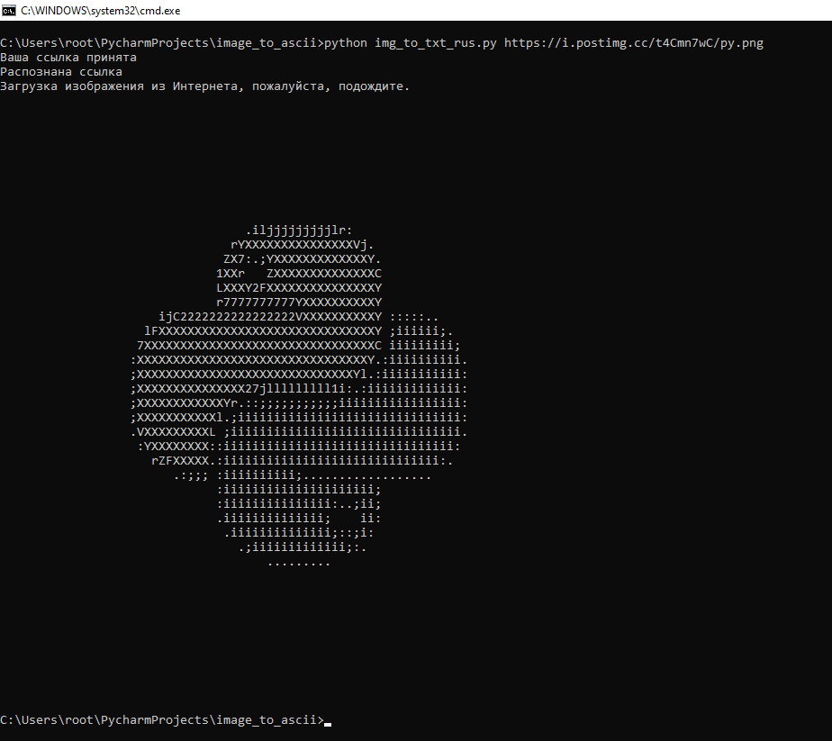

<p>
  
  
  
  
  
  

  
  
  
</p>


# 将图像转换为 .txt 文件
Read in other languages: [English](README.md), [हिन्दी](README.hindi.md), [中國人](README.chinese.md), [Português](README.portuguese.md)

## 怎么运行的？

一切都很简单：你要么下载一个图片文件，要么在运行 python 脚本时指定它的链接，然后
输出你得到一个文本文件，你可以立即在命令行上查看它的外观
你转换的结果。

## 准备和使用机器人的程序

* 克隆存储库或从 github 下载存档或在命令行上使用以下命令

   ```commandline
   $ cmd
   $ git clone https://github.com/BEPb/image_to_ascii
   $ cd image_to_ascii
   ```

### 应用存储库
* 从文件安装依赖项，为此，在命令行中输入以下代码：

```shell
$ pip3 install -r requirements.txt
````

* 程序启动的一般形式：

```shell
$ python3 img_to_txt_rus.py [file/url] [size]
```

*参数：

```shell
[file/url]：本地文件路径或在线图片URL。
[size]：输出txt图片的字符宽度——整数，size越大图片越清晰。
```

### 例子
```shell
$ python3 img_to_txt.py https://i.postimg.cc/t4Cmn7wC/py.png
```
通过执行此命令，您将在当前“文本”文件夹中获得一个名为“out.txt”的文件，您将在控制台中看到该行的输出：





## 视频到文本转换器
原理类似，只是生成的文本文件不存在。

```commandline
cd C:\Users\root\PycharmProjects\image_to_ascii 
python video_to_txt.py animations\filin.gif 150
```


### License
MIT lience
