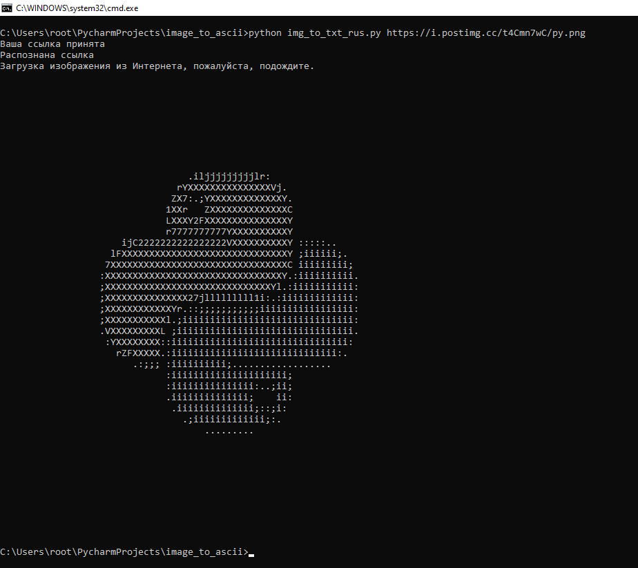
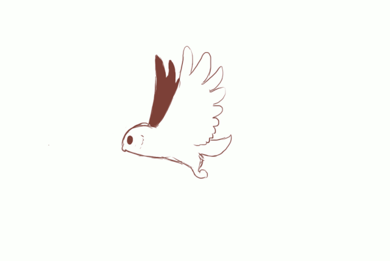
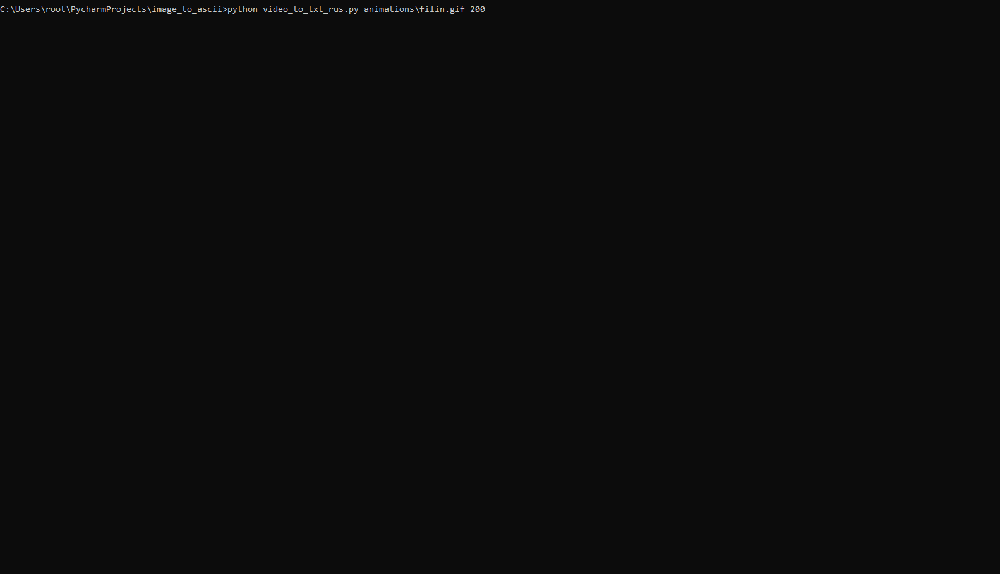

<p>
  
  
  
  
  
  

  
  
  
</p>


# एक छवि को एक .txt फ़ाइल में कनवर्ट करना
Read in other languages: [English](README.md), [Русский](README.ru.md), [中國人](README.chinese.md), [Português](README.portuguese.md)

## यह काम किस प्रकार करता है?

सब कुछ बहुत सरल है: आप या तो चित्र फ़ाइल डाउनलोड करते हैं या पायथन स्क्रिप्ट चलाते समय इसका लिंक निर्दिष्ट करते हैं, और
आउटपुट आपको एक टेक्स्ट फ़ाइल मिलती है, और आप तुरंत कमांड लाइन पर देख सकते हैं कि यह कैसा दिखेगा
आपके रूपांतरण का परिणाम।

## बॉट तैयार करने और उसके साथ काम करने की प्रक्रिया

* रिपॉजिटरी को क्लोन करें या जीथब से आर्काइव डाउनलोड करें या कमांड लाइन पर निम्न कमांड का उपयोग करें

   ```commandline
   $ cmd
   $ git clone https://github.com/BEPb/image_to_ascii
   $ cd image_to_ascii
   ```

### रिपॉजिटरी को लागू करना
* एक फ़ाइल से निर्भरताएँ स्थापित करें, इसके लिए कमांड लाइन में निम्न कोड दर्ज करें:

```shell
$ pip3 install -r requirements.txt
````

* प्रोग्राम लॉन्च का सामान्य रूप:

```shell
$ python3 img_to_txt_rus.py [file/url] [size]
```

* तर्क:

```shell
[file/url]: स्थानीय फ़ाइल पथ या ऑनलाइन छवि URL।
[size]: वर्णों में आउटपुट txt छवि की चौड़ाई - एक पूर्णांक, आकार जितना बड़ा होगा, चित्र उतना ही स्पष्ट होगा।
```

### उदाहरण
```shell
$ python3 img_to_txt.py https://i.postimg.cc/t4Cmn7wC/py.png
```
इस कमांड को क्रियान्वित करने पर, आपको वर्तमान 'टेक्स्ट' फोल्डर में `out.txt` नाम की एक फाइल मिलेगी और आप कंसोल में लाइन का आउटपुट देखेंगे:





## वीडियो से टेक्स्ट कन्वर्टर
सिद्धांत समान है, सिवाय इसके कि परिणामी पाठ फ़ाइल मौजूद नहीं है।

```commandline
cd C:\Users\root\PycharmProjects\image_to_ascii 
python video_to_txt.py animations\filin.gif 150
```






### License
MIT lience
