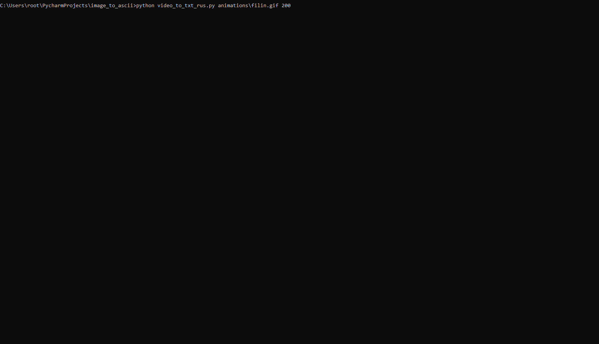

<p>
  
  
  
  
  
  

  
  
  
</p>


# Преобразования изображения в txt-файл
Читать на других языках: [Русский](README.ru.md), [हिन्दी](README.hindi.md), [中國人](README.chinese.md)


## Как это работает?

Все очень просто: вы либо скачиваете файл-картинку или указываете ее ссылку при запуске скрипта на питоне, а на 
выходе получаете текстовый файл, а также сразу сможете просмотреть в командной строке как это будет выглядесть 
результат Вашего преобразования.

## Порядок подготовки и работы с ботом

* Клонировать репозиторий либо скачать архив из github или при помощи следующих команд в командной строке
   ```commandline
   $ cmd
   $ git clone https://github.com/BEPb/image_to_ascii
   $ cd image_to_ascii
   ```


### Применение репозитория
* Устанавливаем зависимости из файла, для этого в командной строке введите следующий код：

```shell
$ pip3 install -r requirements.txt
````

* общая форма запуска программы：

```shell
$ python3 img_to_txt.py [file/url] [size]
```

* аргументы:

```shell
[file/url]: Путь к локальному файлу или URL-адрес онлайн-изображения.
[size]: Ширина вывода txt изображения в символах - целое число, Чем больше размер, тем четче картинка .
```

### Пример
```shell
$ python3 img_to_txt_rus.py https://i.postimg.cc/t4Cmn7wC/py.png
```
Выполнив эту команду, вы получите файл в текущей папке 'texts' с именем `out.txt`, и вы увидите вывод строки в консоли:


## Программа преобразования видео в текст
Принцип аналагичный, за исключением того, что итогового текстового файла не существует

```commandline
cd C:\Users\root\PycharmProjects\image_to_ascii  # переходим в дирректорию со скриптом
python video_to_txt_rus.py animations\filin.gif 150  # запускаем скрипт
```





### Лицензия
MIT lience
